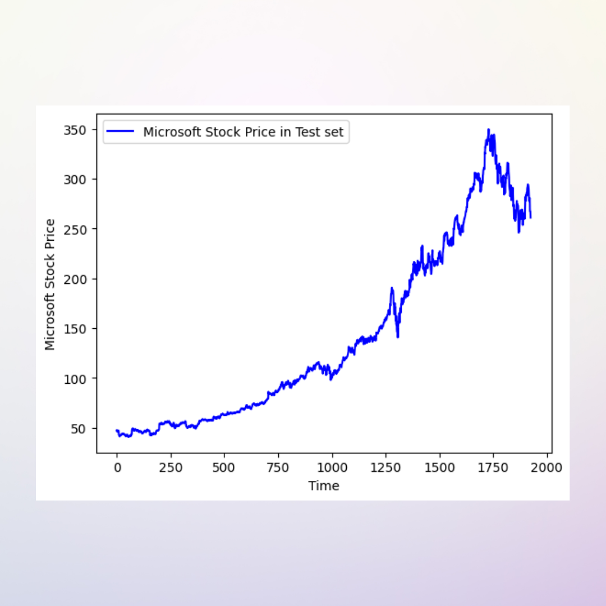

# Stock Price Prediction Project



## Overview

This repository contains a stock price prediction project that utilizes machine learning techniques to forecast the future prices of selected stocks. The goal of this project is to develop accurate and reliable models that can assist investors and traders in making informed decisions.

## Table of Contents

- [Introduction](#introduction)
- [Features](#features)
- [Dependencies](#dependencies)
- [Getting Started](#getting-started)
- [Data Collection](#data-collection)
- [Data Preprocessing](#data-preprocessing)
- [Model Training](#model-training)
- [Evaluation](#evaluation)
- [Deployment](#deployment)
- [Contributing](#contributing)
- [License](#license)

## Introduction

Stock price prediction is a challenging task that involves analyzing historical stock data and developing models that can forecast future prices. This project explores various machine learning algorithms, including regression models, time series analysis, and deep learning, to predict stock prices.

## Features

- **Data Visualization:** Explore and visualize historical stock data to gain insights.
- **Data Preprocessing:** Clean and preprocess the data for training models.
- **Model Training:** Implement and train machine learning models for stock price prediction.
- **Evaluation:** Evaluate the performance of the models using appropriate metrics.
- **Deployment:** Deploy the trained models for real-time predictions.

## Dependencies

Make sure you have the following dependencies installed:

- Python 3.x
- Jupyter Notebooks
- NumPy
- Pandas
- Matplotlib
- Scikit-learn
- TensorFlow
- Keras

You can install the required dependencies using the following command:

```bash
pip install -r requirements.txt
```

## Getting Started

1. Clone the repository:

```bash
git clone https://github.com/your-username/stock-price-prediction.git
cd stock-price-prediction
```

2. Install the dependencies:

```bash
pip install -r requirements.txt
```

3. Explore the Jupyter Notebooks in the `notebooks` directory to understand the workflow and implementation details.

## Data Collection

The data used in this project can be collected from various sources, such as financial APIs or CSV files. Ensure that you have the necessary data before proceeding.

## Data Preprocessing

Clean and preprocess the data to remove missing values, handle outliers, and transform features as needed. The preprocessing steps are documented in the `preprocessing.ipynb` notebook.

## Model Training

Train machine learning models using historical stock data. Experiment with different algorithms and hyperparameters to find the best-performing model. The `model_training.ipynb` notebook provides guidance on this process.

## Evaluation

Evaluate the performance of the trained models using appropriate metrics, such as Mean Absolute Error (MAE) or Root Mean Squared Error (RMSE). The `evaluation.ipynb` notebook demonstrates how to assess model performance.

## Deployment

Once satisfied with the model's performance, deploy it for real-time predictions. This could involve creating a web application or integrating the model into an existing system.

## Contributing

If you would like to contribute to this project, please follow the guidelines outlined in the [CONTRIBUTING.md](CONTRIBUTING.md) file.

## License

This project is licensed under the MIT License - see the [LICENSE](LICENSE) file for details.

Feel free to customize this README file based on your project's specific details and requirements. Good luck with your stock price prediction project!

HappyCoding!

-Rahul Dasari
